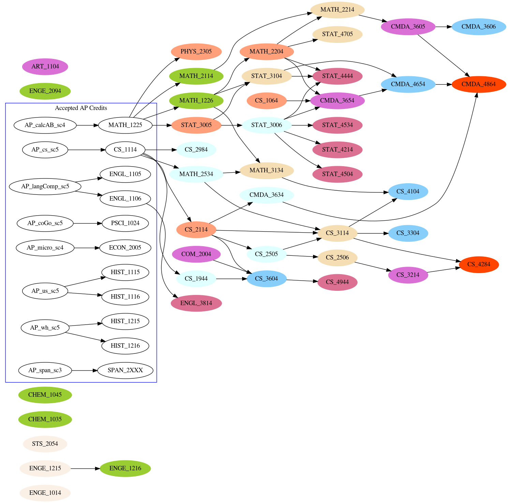

# resume
Latex resume and dot graph for college courses.

Install Latex things:
```
sudo apt-get install texlive-latex-base texlive-fonts-recommended texlive-fonts-extra texlive-latex-extra
```
Run:
```
pdflatex ./resume.tex
```
Don't run:
```
pdftex ./resume.tex
```
To make directed graph of college courses (install `xdot` and `eog`):
```
cd ./college_graph
./gen
```
This is my college course graph, color-coded by semester:

